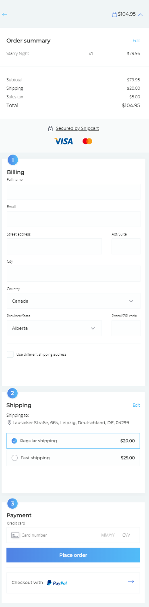
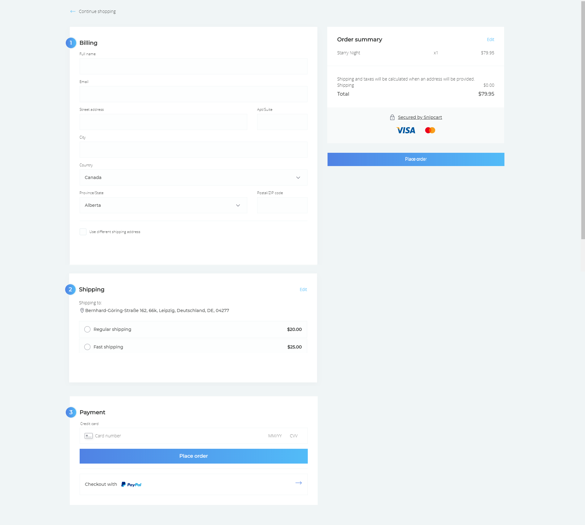

# Check it out!

Try to build a checkout-experience for your imaginary products. Try to start with the [DCI Boilerplate I](https://github.com/LE-FBW1/dci-boilerplate) and use the **bootstrap framework** for your checkout UI.

The standard checkout flow goes like this:

1. Shopping Cart (contents)
1. Billing Information (optional: depends on the merchant)
1. Shipping Information (possibly the same as Billing Information)
1. Shipping Method
1. Payment Method
1. Confirmation

For more information and a best-practice-guide, you should have a look at this guide by snipcart: [Optimize Your E-Commerce Checkout Flow for 2019](https://snipcart.com/ecommerce-checkout). Especially the part 3 "Nail the Checkout UX", is worth a read!

As a rough guideline of how a static checkout could/should look like (without server-side logic or JavaScript), here is a visual example (mobile and desktop):

Mobile checkout:

Desktop checkout:

 
 > source: https://demo.snipcart.com/#/
 
